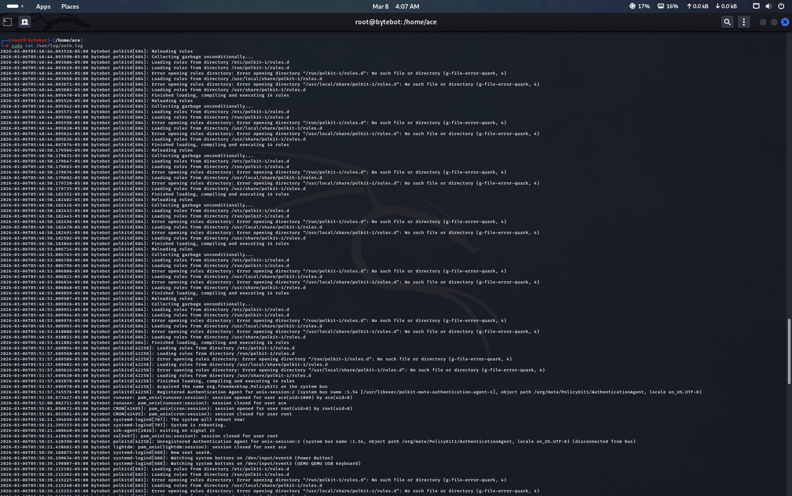

# Linux Log Analysis

## Objective
Analyse system logs to detect suspicious login attempts and security events.

## Tools Used
- Linux Terminal
- Auth Logs (/var/log/auth.log)

## Description
Reviewed Linux authentication logs to identify failed login attempts and suspicious access patterns.

Security analysts use log analysis to detect brute-force attacks and unauthorised access attempts.

## Key Learning
Learned how to investigate authentication logs and identify indicators of suspicious activity.

## Outcome
Detected multiple failed login attempts, which could indicate a brute-force attack.
## Log Analysis Screenshot

